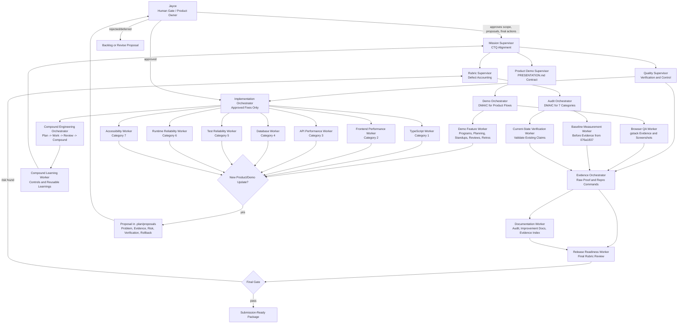

# Agent Team Flowchart

This flowchart shows how the ShipShape agent team should work after adding the Six Sigma quality layer. Jayce remains the human gate for product/demo changes, final submission actions, and any proposal that changes scope.

## How To Edit The Team

Good edit points:

- Add a new worker under the relevant orchestrator.
- Split a worker if the file surface is too broad.
- Add a supervisor only when it owns a distinct failure mode.
- Remove roles that are not tied to a CTQ, defect class, or verification need.

Keep Jayce as the final human gate for proposed product/demo changes.
