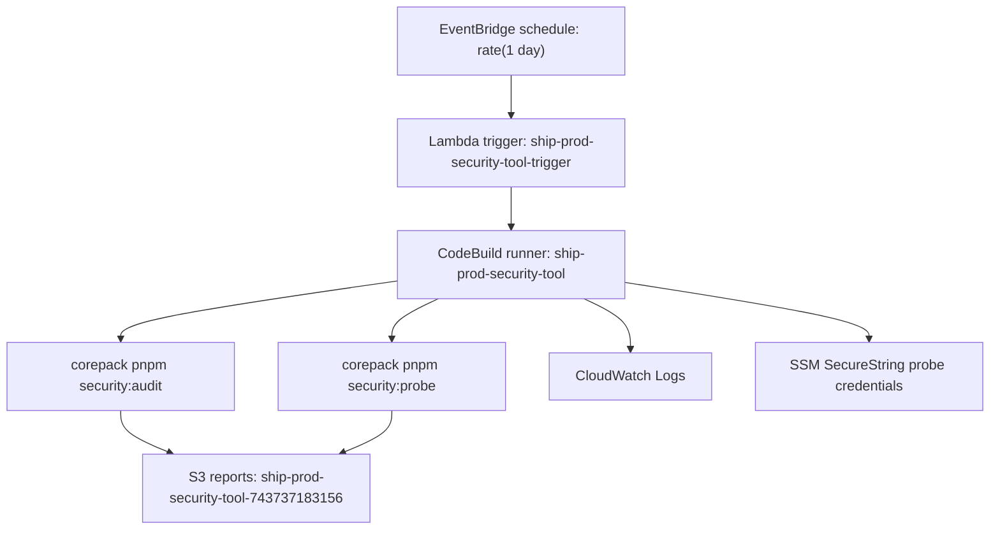

# ShipShape AWS Infrastructure

Current canonical branch: `master`

Current production frontend: `https://d9o5hawnpdm4g.cloudfront.net`

Current production API health route: `http://ship-api-prod.eba-yrjupwcv.us-east-2.elasticbeanstalk.com/health`

This repository is now deployed on AWS using the government-compliant architecture planned for ShipShape: a React static frontend on S3/CloudFront, an Express + WebSocket API on Elastic Beanstalk behind an ALB, Aurora PostgreSQL 16 for data, SSM Parameter Store for secrets, and a scheduled AWS security-tool runner for Category 8 evidence.

## Current Production Topology

```text
+--------------------------------------------------------------------------------+
| CloudFront distribution                                                         |
|  - React/Vite static app from S3                                                |
|  - /api/* and /health proxied to Elastic Beanstalk API                          |
|  - Production portal: https://d9o5hawnpdm4g.cloudfront.net                      |
+---------------------------------------+----------------------------------------+
                                        |
                                        v
+--------------------------------------------------------------------------------+
| Elastic Beanstalk API environment                                               |
|  - Express REST API                                                             |
|  - WebSocket collaboration server                                               |
|  - Health: http://ship-api-prod.eba-yrjupwcv.us-east-2.elasticbeanstalk.com/... |
+---------------------------------------+----------------------------------------+
                                        |
                                        v
+--------------------------------------------------------------------------------+
| AWS data and control plane                                                      |
|  - Aurora Serverless v2 PostgreSQL 16                                           |
|  - SSM Parameter Store for app and probe credentials                            |
|  - CloudWatch logs for API, Lambda, and CodeBuild                               |
|  - S3 buckets for frontend and security-tool reports                            |
+--------------------------------------------------------------------------------+
```

## Security Tool Extension

Category 8 adds a scheduled security pipeline to the production architecture:



Current security-tool report prefix:

```text
s3://ship-prod-security-tool-743737183156/latest/
```

Tracked report copies are committed under `docs/security-tool/`:

- `docs/security-tool/latest-security-report.json`
- `docs/security-tool/latest-security-report.md`
- `docs/security-tool/latest-probe-report.json`
- `docs/security-tool/latest-probe-report.md`
- `docs/security-tool/aws-architecture.md`
- `docs/security-tool/ShipShape Security Tool Walkthrough.docx`

Latest tracked probe result:

```text
Target: https://d9o5hawnpdm4g.cloudfront.net
Checks: 17
Passed: 17
Failed: 0
```

## Terraform Layout

```text
terraform/
|-- environments/
|   `-- prod/
|       |-- main.tf
|       |-- variables.tf
|       |-- outputs.tf
|       |-- versions.tf
|       |-- terraform.tfvars
|       `-- security-tool.tf
|-- lambda/
|   `-- security-tool-trigger/
`-- modules/
```

The production security-tool resources live in:

```text
terraform/environments/prod/security-tool.tf
```

## Application Layout

```text
ship/
|-- api/
|   |-- Dockerfile
|   |-- .platform/nginx/conf.d/websocket.conf
|   |-- .ebextensions/
|   `-- src/
|-- web/
|   |-- dist/
|   `-- src/
|-- shared/
|-- scripts/
|   |-- deploy-api.sh
|   |-- deploy-frontend.sh
|   |-- deploy-infrastructure.sh
|   |-- security-audit.mjs
|   `-- security-probe.mjs
|-- docs/
|   |-- audit-evidence/
|   `-- security-tool/
`-- terraform/
```

## Deployment Model

Infrastructure changes are separated from application deploys:

1. Terraform creates or updates durable AWS resources.
2. API deploys publish a new Elastic Beanstalk application version.
3. Frontend deploys sync `web/dist` to S3 and invalidate CloudFront.
4. Security-tool runs are started by EventBridge/Lambda/CodeBuild and upload report bundles to S3.

Useful commands:

```bash
# Build shared package and frontend
corepack pnpm --filter @ship/shared build
$env:VITE_API_URL=''; corepack pnpm --filter @ship/web exec vite build --sourcemap

# Build/type-check API
corepack pnpm --filter @ship/api type-check

# Run security evidence locally
corepack pnpm security:audit
corepack pnpm security:probe
```

## Current Cost Shape

The original target estimate was about `$80/month` for a low-traffic deployment:

| Resource | Current role | Cost notes |
| --- | --- | --- |
| Elastic Beanstalk / EC2 | Express API + WebSocket server | Main always-on compute cost |
| Aurora Serverless v2 | PostgreSQL 16 database | ACU usage depends on minimum capacity and activity |
| ALB | API routing to EB | Always-on load-balancer cost |
| S3 + CloudFront | React static frontend | Low cost at audit/demo traffic |
| SSM Parameter Store | Secrets and probe credentials | Standard parameters are free |
| Lambda + EventBridge | Security-tool trigger | Near-zero idle cost |
| CodeBuild | Security-tool runner | Pay per build minute |
| CloudWatch Logs | API/security-tool logs | Depends on retention and volume |

## Compliance-Oriented Decisions

- AWS-hosted architecture instead of Render for final deployment.
- Static frontend is isolated from API compute through S3/CloudFront.
- API runs on Elastic Beanstalk with WebSocket support.
- Aurora PostgreSQL 16 is encrypted at rest.
- Security-tool report bucket blocks public access, enables versioning, and uses server-side encryption.
- Secrets and probe credentials are stored in SSM Parameter Store, not committed to Terraform.
- CloudWatch captures API, CodeBuild, and Lambda execution logs.
- Docker images avoid Alpine and favor slim runtime variants.
- Category 8 security evidence is repeatable locally and through AWS automation.
