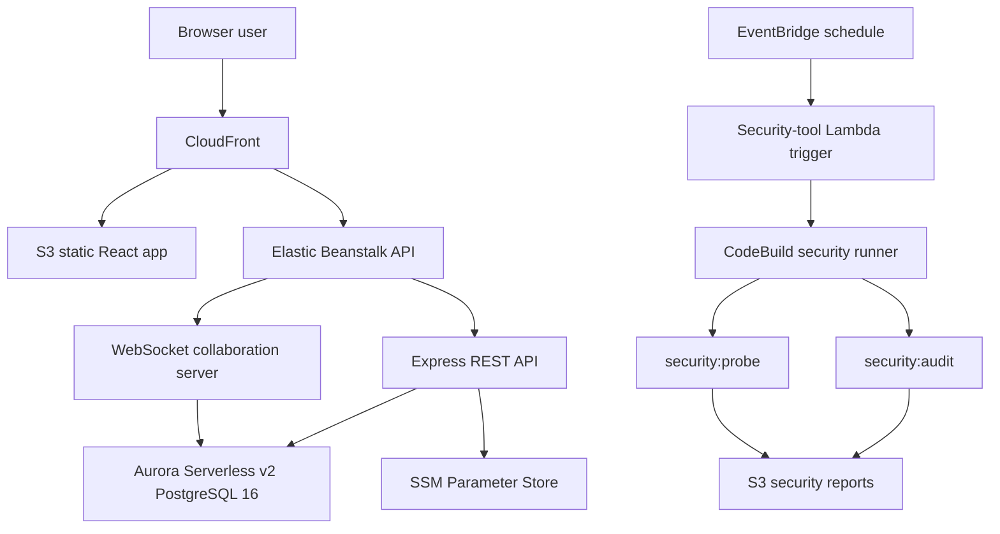

# Ship Architecture

Current canonical branch: `master`

Current production frontend: `https://d9o5hawnpdm4g.cloudfront.net`

Current production API health: `http://ship-api-prod.eba-yrjupwcv.us-east-2.elasticbeanstalk.com/health`

This document summarizes the current consolidated ShipShape build. It includes the core Ship application, the AWS production deployment, the Observer Dashboard, and the Category 8 security tool.

## System Overview

Ship is a government-focused project management application for documentation, issues, projects, weekly plans, retros, and team accountability. The architecture uses a unified document model: wikis, issues, programs, projects, weeks, people, weekly plans, and retros are all documents with type-specific properties.

The current build adds:

- AWS production deployment through CloudFront, S3, Elastic Beanstalk, Aurora PostgreSQL, and SSM Parameter Store.
- Offline app-shell recovery for authenticated frontend routes.
- Session activity write throttling and stricter document-ID validation.
- Observer Dashboard views for leadership/reviewer workflows.
- Category 8 security tooling with static scanning, live-app probing, AWS CodeBuild automation, and S3 report storage.

## Monorepo Structure

```text
ship/
|-- api/
|   |-- src/
|   |   |-- routes/             # REST endpoints
|   |   |-- collaboration/      # WebSocket + Yjs sync
|   |   |-- db/                 # PostgreSQL schema, migrations, seed
|   |   |-- middleware/         # Auth, CSRF, visibility, access checks
|   |   |-- openapi/            # OpenAPI schemas
|   |   `-- utils/              # Shared API helpers
|   |-- Dockerfile
|   `-- package.json
|-- web/
|   |-- src/
|   |   |-- components/
|   |   |-- hooks/
|   |   |-- pages/
|   |   `-- lib/
|   |-- public/
|   `-- package.json
|-- shared/
|   `-- src/
|-- scripts/
|   |-- security-audit.mjs
|   |-- security-probe.mjs
|   |-- audit-api-benchmark.mjs
|   `-- audit-type-safety.mjs
|-- terraform/
|   |-- environments/prod/
|   |-- lambda/security-tool-trigger/
|   `-- modules/
|-- docs/
|   |-- audit-evidence/
|   |-- security-tool/
|   `-- claude-reference/
`-- README.md
```

## Runtime Architecture



## Production Deployment

| Surface | Current value |
| --- | --- |
| Frontend | `https://d9o5hawnpdm4g.cloudfront.net` |
| API health | `http://ship-api-prod.eba-yrjupwcv.us-east-2.elasticbeanstalk.com/health` |
| Security results page | `https://d9o5hawnpdm4g.cloudfront.net/programs/security` |
| Security report bucket | `s3://ship-prod-security-tool-743737183156/latest/` |
| GitLab master | `https://labs.gauntletai.com/jayceparabellum/ship/-/tree/master` |
| GitHub master | `https://github.com/jayceparabellum/ship/tree/master` |

Deployment responsibilities:

1. Terraform manages durable AWS infrastructure.
2. Elastic Beanstalk hosts the Express API and WebSocket collaboration server.
3. S3/CloudFront hosts the React frontend and proxies API routes.
4. Aurora PostgreSQL stores application data.
5. SSM Parameter Store stores app and probe secrets.
6. CodeBuild/Lambda/EventBridge run the scheduled security tool.

## Unified Document Model

The central data model is a single `documents` table with a `document_type` discriminator and JSONB `properties`.

Primary document types:

| Type | Purpose |
| --- | --- |
| `wiki` | General documentation |
| `issue` | Work item, bug, task, or action item |
| `program` | Long-lived product or initiative |
| `project` | Time-bounded deliverable |
| `sprint` | Week container, historically named sprint |
| `person` | User/person profile document |
| `weekly_plan` | Weekly intent document |
| `weekly_retro` | Weekly reflection document |

Associations between documents are handled through direct columns where efficient and through `document_associations` for flexible relationships such as issue-to-project and issue-to-week links.

## API Architecture

The API is an Express service with:

- Cookie/session authentication.
- CSRF protection for state-changing routes.
- Workspace visibility checks.
- Route-level validation with Zod.
- OpenAPI output under `api/openapi.json` and `api/openapi.yaml`.
- WebSocket upgrade handling for collaborative document editing.

Important current routes:

| Route area | Purpose |
| --- | --- |
| `/api/auth/*` | Login, session identity, logout, CSRF |
| `/api/documents/*` | Unified document CRUD and conversion |
| `/api/issues/*` | Issue list and issue-specific workflows |
| `/api/weeks/*` | Weekly planning and review workflows |
| `/api/dashboard/*` | Dashboard and Observer Dashboard data |
| `/api/security-tool/*` | Security-tool report surface |
| `/collaboration/*` | Yjs WebSocket collaboration |

Recent hardening:

- `api/src/utils/auth-context.ts` centralizes authenticated request context narrowing.
- `api/src/middleware/auth.ts` throttles session `last_activity` writes.
- `api/src/routes/documents.ts` validates malformed document IDs before PostgreSQL UUID casts.
- `api/src/collaboration/index.ts` rejects unauthorized and malformed collaboration attempts.

## Frontend Architecture

The frontend is a React/Vite app with:

- Route-level code splitting.
- TanStack Query for server state.
- IndexedDB-backed query persistence.
- TipTap + Yjs for collaborative rich text editing.
- A service worker for offline app-shell recovery.
- Dashboard and Observer Dashboard surfaces.
- Security-tool result page at `/programs/security`.

Main frontend surfaces:

| Area | Files |
| --- | --- |
| App shell | `web/src/pages/App.tsx` |
| Dashboard | `web/src/pages/Dashboard.tsx`, `web/src/hooks/useObserverDashboard.ts` |
| Editor | `web/src/components/Editor.tsx` |
| Security results | `web/src/pages/SecurityToolResults.tsx` |
| API client | `web/src/lib/api.ts` |

## Realtime Collaboration

Collaboration uses TipTap, Yjs, y-websocket, and y-indexeddb.

Flow:

1. Browser loads cached document state from IndexedDB.
2. Browser connects to the WebSocket collaboration room.
3. API validates session and document access during upgrade.
4. Yjs updates are broadcast to connected collaborators.
5. Server persists debounced document state to PostgreSQL.

Room prefixes follow document type, for example:

- `doc:{uuid}`
- `issue:{uuid}`
- `project:{uuid}`
- `program:{uuid}`
- `sprint:{uuid}`

## Security Tool Architecture

Category 8 is implemented as both local scripts and AWS automation.

Local commands:

```bash
corepack pnpm security:audit
corepack pnpm security:probe
```

AWS resources:

| Resource | Current value |
| --- | --- |
| Lambda trigger | `ship-prod-security-tool-trigger` |
| CodeBuild runner | `ship-prod-security-tool` |
| Schedule | `rate(1 day)` |
| S3 report prefix | `s3://ship-prod-security-tool-743737183156/latest/` |

Tracked evidence:

- `docs/security-tool/latest-security-report.json`
- `docs/security-tool/latest-security-report.md`
- `docs/security-tool/latest-probe-report.json`
- `docs/security-tool/latest-probe-report.md`
- `docs/security-tool/aws-architecture.md`

Latest tracked results:

```text
Static scanner: 13 passed / 0 failed
Live production probe: 17 passed / 0 failed
```

## Audit Evidence Architecture

Final rubric evidence is tracked in `docs/audit-evidence/`.

Key final evidence files:

| Category | Evidence |
| --- | --- |
| Type safety | `docs/audit-evidence/type-safety-after-auth-context.json` |
| Bundle size | `docs/audit-evidence/bundle-analysis-after-route-splitting.json` |
| API response time | `docs/audit-evidence/api-benchmarks-after-session-touch-throttle.json` |
| Database query efficiency | `docs/audit-evidence/auth-query-count-after.json` |
| Test quality | `docs/audit-evidence/web-test-run-after-jsdom-pin.json` |
| Runtime/edge cases | `docs/audit-evidence/browser-runtime-after-offline-shell.json` |
| Accessibility | `docs/audit-evidence/browser-accessibility-after-contrast.json` |
| Security tool | `docs/security-tool/latest-probe-report.json` |

## Related Documentation

- `README.md` - Setup, current build links, final evidence overview.
- `INFRASTRUCTURE.md` - Current AWS deployment and security-tool infrastructure.
- `SECURITY.md` - Security policy and security-tool operations.
- `docs/security-tool/README.md` - Category 8 scanner/probe usage.
- `docs/shipshape-improvement-documentation.md` - Before/after rubric proof.
- `docs/category-1-8-final-handoff.md` - Final reviewer handoff.
