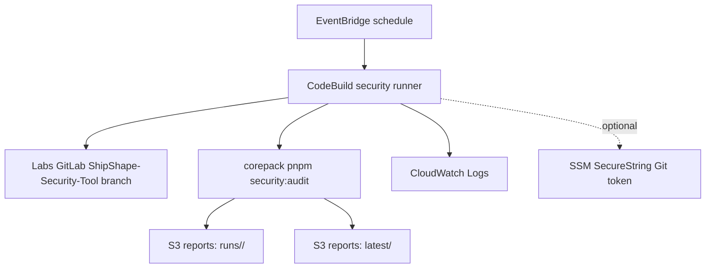

# AWS Security Tool Architecture

This design extends the deployed Ship AWS architecture with an optional, scheduled security audit runner.

## Purpose

The local command `corepack pnpm security:audit` remains the source of truth. AWS runs the same command on a schedule, stores immutable report copies, and keeps the latest report available for review.

## AWS Services

| Service | Purpose |
| --- | --- |
| CodeBuild | Clones the `ShipShape-Security-Tool` branch and runs `corepack pnpm security:audit` |
| S3 | Stores JSON and Markdown security reports under `runs/<run-id>/` and `latest/` |
| CloudWatch Logs | Captures CodeBuild execution logs |
| EventBridge | Starts CodeBuild on a schedule |
| IAM | Grants least-privilege access to logs, S3 report writes, and optional SSM token reads |
| SSM Parameter Store | Optional SecureString location for a GitLab token if the Labs repository requires authenticated clone |

## Flow



## Terraform Toggle

The AWS resources are disabled by default.

Enable them in `terraform.tfvars`:

```hcl
enable_security_tool = true

security_tool_git_repo_url = "https://labs.gauntletai.com/jayceparabellum/ship.git"
security_tool_git_branch   = "ShipShape-Security-Tool"

# Optional, only needed if CodeBuild cannot clone the repository anonymously.
security_tool_git_token_parameter_name = "/ship/prod/SECURITY_TOOL_GIT_TOKEN"

# Keep discovery non-blocking at first. Change to true once findings are triaged.
security_tool_fail_on_findings = false
```

## Token Setup

If Labs GitLab requires authentication from CodeBuild, create the token outside Terraform:

```bash
aws ssm put-parameter \
  --name /ship/prod/SECURITY_TOOL_GIT_TOKEN \
  --type SecureString \
  --value "<gitlab-token>" \
  --overwrite
```

Then set:

```hcl
security_tool_git_token_parameter_name = "/ship/prod/SECURITY_TOOL_GIT_TOKEN"
```

## Report Locations

Terraform outputs:

- `security_tool_report_bucket`
- `security_tool_codebuild_project`
- `security_tool_latest_report_prefix`

Reports are written to:

```text
s3://<security-tool-report-bucket>/runs/<run-id>/latest-security-report.json
s3://<security-tool-report-bucket>/runs/<run-id>/latest-security-report.md
s3://<security-tool-report-bucket>/latest/latest-security-report.json
s3://<security-tool-report-bucket>/latest/latest-security-report.md
```

## Review Before Applying

This branch only defines the AWS services. Applying the Terraform should happen after review because it creates billable resources:

- 1 S3 bucket
- 1 CodeBuild project
- 1 CloudWatch log group
- 1 EventBridge scheduled rule
- IAM roles and policies

Estimated idle cost is near zero. Costs accrue mainly when CodeBuild runs and when reports/logs are stored.
